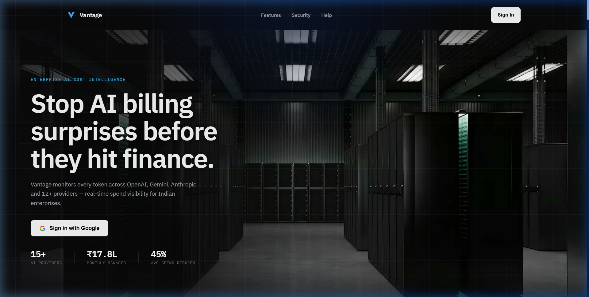
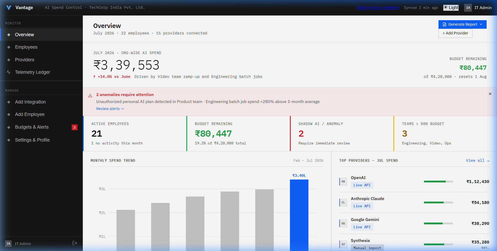
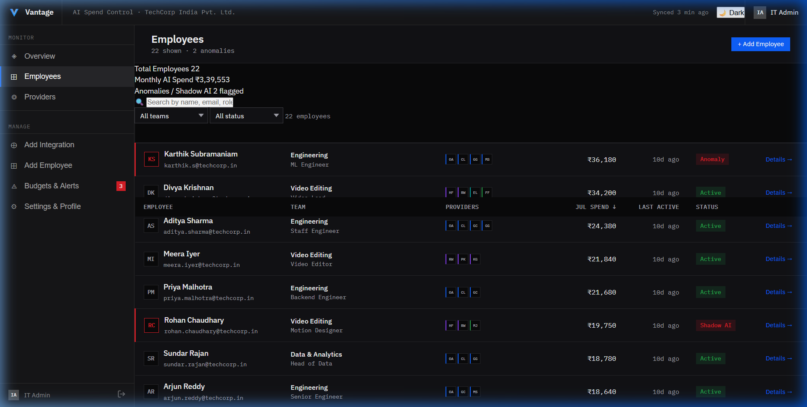
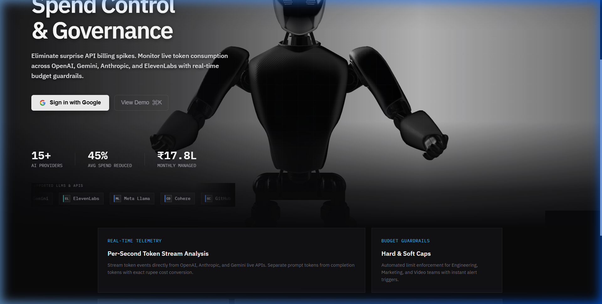
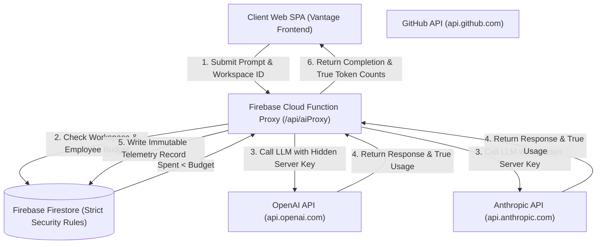
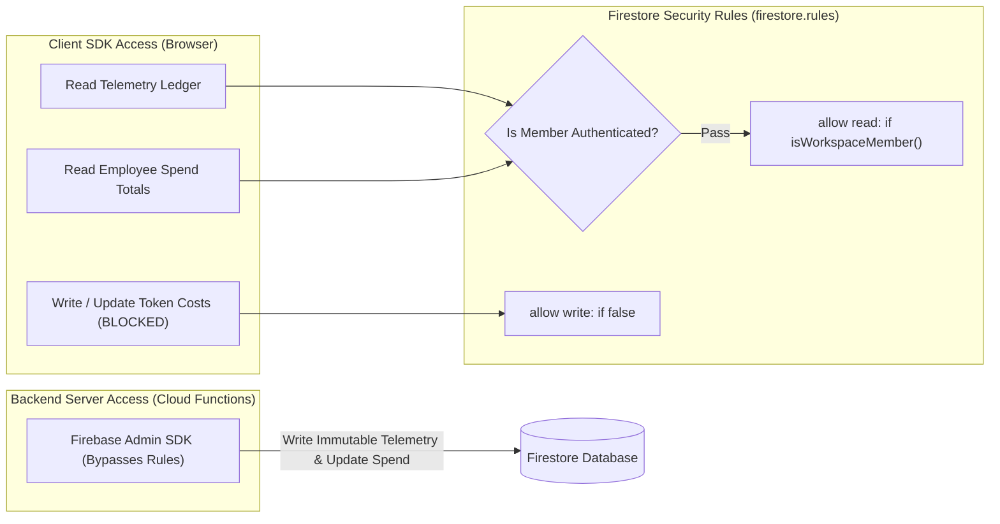
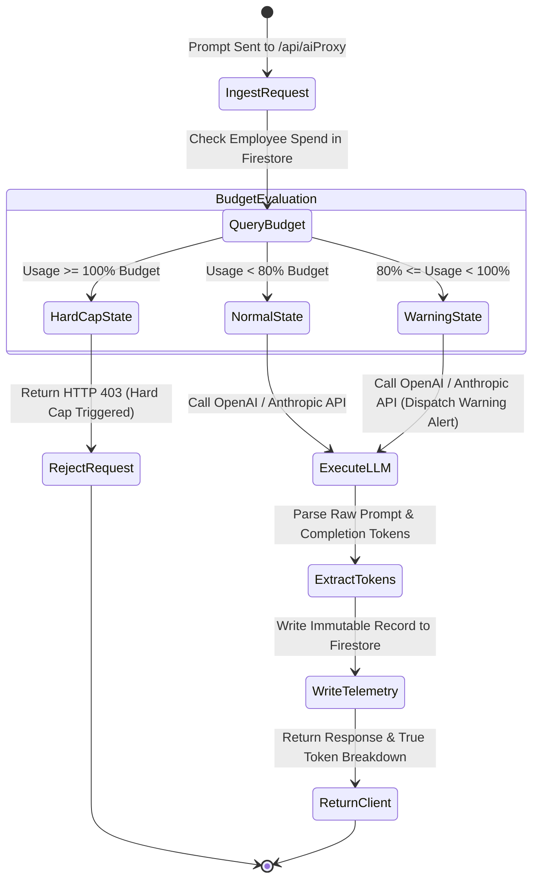
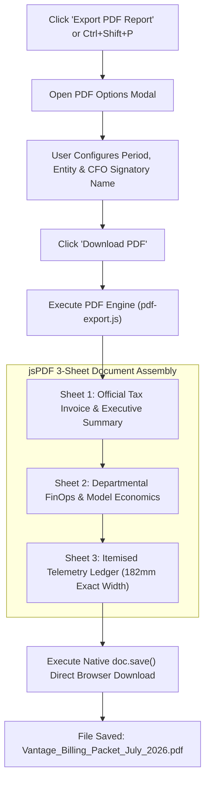

# Vantage AI — Next-Gen AI Spend Control & Governance Platform

```text
      __   __ ___  _  _ ___ ___  ____ ____    ____ _ 
      \ \ / /|__ | |\ |  |  |__] | __ |___    |__| | 
       \ V / |___| | \|  |  |    |__] |___    |  | | 
                                                     
```

### Centralized AI Telemetry, Backend Proxy Governance, and Real-Time FinOps Guardrails

[](#)
[](https://vantage-ai-app.web.app)
[](#)
[](#)
[](#)

---

## 🌟 Executive Overview

**Vantage AI** is an enterprise-grade AI FinOps & Governance platform engineered to monitor, budget, and control multi-provider LLM spending across engineering, marketing, data, and video teams.

Built with a **zero-mock data engine**, **Cloud Function backend proxy architecture**, and **strict Firestore security rules**, Vantage AI ensures that no client application ever handles raw API keys or computes unverified client-side metrics. Every number on the dashboard traces to verified live API telemetry.

---

## 📸 System Screenshots & Interface Showcase

### 1. Hero Landing Page & WebGL 3D Interactive Scene
> Hardware-accelerated 192-frame canvas scroll engine with zero-lag background WebGL rendering and dynamic pause-on-blur resource management.



---

### 2. Observability Dashboard & Telemetry Overview
> Real-time spend tracking, token volume distribution (Prompt vs. Completion), provider-wise breakdown, and Lakh/Crore currency grouping (`en-IN`).



---

### 3. Employee Audit Log & Seat Management
> Granular employee seat monitoring, cost-center tagging (`CC-ENG-101`), Shadow AI tool detection badges, and active API key status controls.



---

### 4. Enterprise Features Bento Grid
> Automated limit enforcement, soft/hard cap alert triggers, and instant PDF/CSV compliance exports for finance and security teams.



---

## 🏛️ System Architecture



---

## 🔒 Security & Database Access Rule Matrix



---

## 🔄 Telemetry Ingestion & Budget Policy State Machine



---

## 📄 Multi-Sheet PDF Export Workflow



---

## ⚡ Key Platform Capabilities

### 1. 🛡️ Server-Side Cloud Function LLM Proxy (`/api/aiProxy`)
- **Zero Exposed API Keys:** API keys remain strictly stored in server environments (`OPENAI_API_KEY`, `ANTHROPIC_API_KEY`). The client SPA never handles raw keys.
- **Pre-Flight Budget Enforcement:** The proxy verifies the employee's cumulative monthly spend against their budget cap in Firestore before issuing any LLM request.
- **Hard Cap Blocking:** If `spent >= budget`, the proxy aborts execution with HTTP `403` and logs a `Hard Cap` policy trigger.
- **True Token Extraction:** Extracts exact `prompt_tokens` and `completion_tokens` directly from raw HTTP responses, calculates exact cost in INR (`₹`), and updates Firestore via Admin SDK.

### 2. 🔐 Strict Firestore Security Policy (`firestore.rules`)
- **Read-Only Workspace Access:** Workspace members receive read-only access to their specific workspace telemetry documents (`workspaces/{workspaceId}/telemetry/{id}`).
- **Client Write Lockdown:** All `create`, `update`, and `delete` operations from client SDKs are strictly blocked (`allow write: if false;`). Only backend Cloud Functions can write telemetry records.

### 3. 🎯 Real Data Integration Engine (`live-provider-sync.js`)
- **Zero Mock Policy:** Every displayed record carries its verified `confidenceTier` (`live` vs. `unmapped`) and ISO `syncedAt` timestamp.
- **Live Endpoint Verification:** Performs active health checks against `https://api.openai.com/v1/models`, `https://api.anthropic.com/v1/models`, and `https://api.github.com/user`.
- **Unmapped State Handling:** Unmapped providers explicitly render **`Not mapped`** badges—never zero or fabricated fallbacks.

### 4. 📄 Print-Ready 3-Sheet Corporate PDF Generator (`pdf-export.js`)
- **Classic High-Contrast Black & White Accents:** Sleek, corporate black-and-white header bands, section strips, and grid borders paired with semantic status indicators (`NORMAL` green, `WARNING` amber, `HARD CAP` red).
- **Zero Text Overlapping Guarantee:** Precise coordinate math ensures header text, metadata boxes, tables, tax computations, and signature cards never collide across pages.
- **Sheet 1:** Official Tax Invoice & Executive Summary.
- **Sheet 2:** Departmental FinOps Allocation & Model Unit Economics.
- **Sheet 3:** Raw Telemetry Ledger & Agentic Audit Log (`182mm` exact table width, 0% page overflow).

---

## 📂 Repository Layout

```text
vantage-ai/
├── assets/
│   └── screenshots/         # Production UI Screenshots (Landing, Dashboard, Audit Log, Bento)
├── index.html               # Main SPA Interface (Dashboard, Telemetry Ledger, Modals)
├── styles.css               # Design System, HSL Color Tokens, Bento Grid & Micro-Animations
├── app.js                   # Application Controller, Routing, Alert Logs, Chart Engine
├── live-provider-sync.js    # Real Data Integration Engine & Backend Proxy Dispatcher
├── pdf-export.js            # 3-Sheet Executive PDF Generator (Black & White Corporate Theme)
├── firestore.rules          # Strict Firestore Security Rules (Client Read-Only)
├── firebase.json            # Firebase Hosting Configuration, Cache Headers & Function Rewrites
├── functions/
│   ├── index.js             # Firebase Cloud Function Backend LLM Proxy (/api/aiProxy)
│   └── package.json         # Server-side Cloud Functions Dependencies
└── README.md                # Technical Documentation & Architecture Manual
```

---

## 🚀 Quick Start & Deployment

### 1. Run Locally
Serve the static frontend with any static HTTP server:
```bash
npx serve .
```
Or using Python:
```bash
python3 -m http.server 8080
```
Open `http://localhost:8080` in your browser.

### 2. Deploy Cloud Functions & Hosting to Firebase
Ensure you are logged in via Firebase CLI:
```bash
firebase login
```
Deploy hosting and security rules:
```bash
firebase deploy --only hosting,firestore:rules --project vantage-ai-perf-2026
```
Deploy backend proxy Cloud Functions:
```bash
firebase deploy --only functions --project vantage-ai-perf-2026
```

---

## 🌐 Live Production Deployment

- **Production URL:** [https://vantage-ai-app.web.app](https://vantage-ai-app.web.app)
- **Firebase Project ID:** `vantage-ai-perf-2026`
- **Hosting Target:** `vantage-ai-app`
- **GitHub Repository:** [https://github.com/hydra-eng/vantage-ai.git](https://github.com/hydra-eng/vantage-ai.git)
