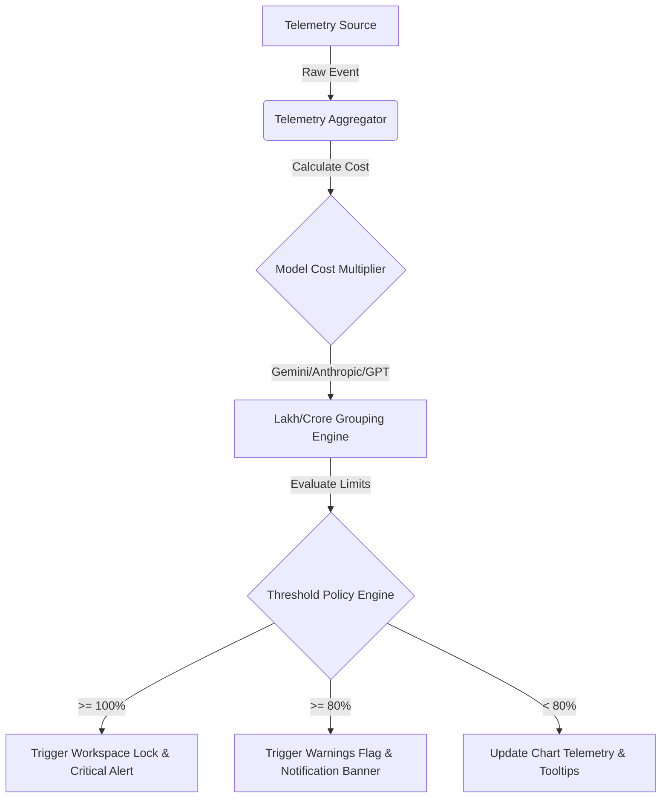
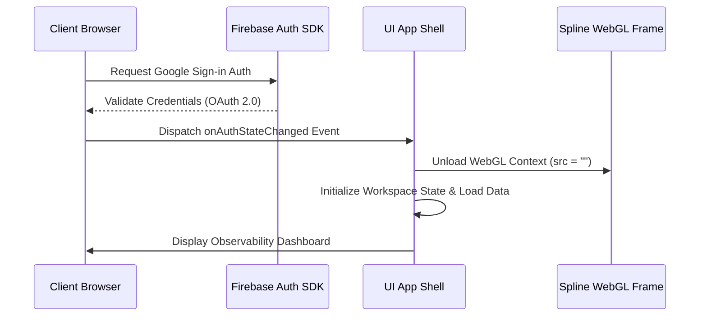

# vantage.ai

```
      __   __ ___  _  _ ___ ___  ____ ____    ____ _ 
      \ \ / /|__ | |\ |  |  |__] | __ |___    |__| | 
       \ V / |___| | \|  |  |    |__] |___    |  | | 
                                                     
```

### Next-generation AI spend control, telemetry, and client-side governance.

[](#)
[](https://vantage-ai-eda2c.web.app)
[](#)

---

Vantage AI provides centralized visibility and governance for enterprise artificial intelligence API consumption. Built as a self-contained Single-Page Application (SPA) with Firebase Integration and WebGL-accelerated 3D background telemetry, Vantage AI translates raw token metrics into real-time spend analytics, budget alerts, and active seat monitoring.

---

## 🛠️ Stack & Languages

Vantage AI is constructed entirely with vanilla frontend technologies to maximize performance and portability:

*   **HTML5**
    *   Semantic structure with direct DOM mounting points.
    *   Isolated layout viewports (`#login-view`, `#app-shell`).
*   **CSS3 (Custom Design System)**
    *   Native HSL dynamic variables for dark-mode.
    *   Complex linear and radial backdrop-filters for the Vercel-like bento grid.
    *   Hardware-accelerated animations (`will-change: transform`) powering the marquee scrolling ribbons.
*   **ES6+ Javascript (Vanilla DOM & State)**
    *   Event-delegation architecture for dynamic sidebar navigation tabs.
    *   On-the-fly local CSV generation utilizing standard MIME attachment buffers.
    *   `en-IN` locale formatting translating numeric tokens into Lakh/Crore outputs.
*   **Firebase SDK v10 (Modular)**
    *   `firebase-app.js` and `firebase-auth.js` modular libraries loaded via CDN.
    *   Google OAuth 2.0 login popup handling with cached auth state validation.
*   **WebGL / Spline 3D**
    *   3D Nexbot model interactive scene injected inside an isolated viewport.
    *   Performance scale-shifting crop methods (`transform: scale(1.15)`) to mask vendor embeds.

---

## ⚡ Core Capabilities

*   **Zero-Lag WebGL Background** - Optimized 3D Spline character concept running within an isolated background container using pointer-event bypasses to prevent scrolling stutters.
*   **Per-Second Telemetry Ingestion** - Live token tracking (Prompt and Completion breakdown) translated into local currency groupings (INR Lakh/Crore formatting).
*   **Dual-Threshold Budget Guardrails** - Automatic triggers at 80% (warning state) and 100% (hard cap block) of monthly allocations, managed via client-side notification triggers.
*   **Unified Key Access** - Consolidated management for OpenAI, Google Gemini, Anthropic Claude, ElevenLabs, Meta Llama, and Cohere.
*   **Dynamic Workspaces** - Collapsible navigation layout, responsive detail drawers for individual employee audit logs, and on-the-fly CSV generation.

---

## 📊 Ingestion & Telemetry Architecture



### Authentication & WebGL Resource Lifecycle



---

## 📂 Repository Layout

```
├── index.html         # Monolithic SPA (Views, UI layout, script logic, and stylesheets)
├── firebase.json      # Production Hosting config, SPA rewrites, Cache-Control headers
├── .firebaserc        # Target mapping configuration (vantage-ai-eda2c)
└── .gitignore         # Local asset exclusion policies
```

---

## 🚀 Quick Start

### 1. Run Locally
Serve the directory using any static HTTP server. For example:
```bash
npx serve .
```
Or with Python:
```bash
python3 -m http.server 8080
```
Open **`http://localhost:8080`** in your browser.

### 2. Deploy to Production
Make sure you have `firebase-tools` installed:
```bash
npm install -g firebase-tools
firebase deploy --only hosting --project vantage-ai-eda2c
```
Live production instances are hosted at **`https://vantage-ai-eda2c.web.app`**.
