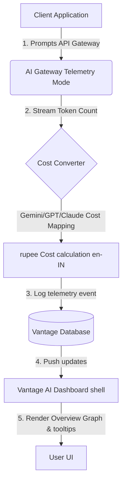
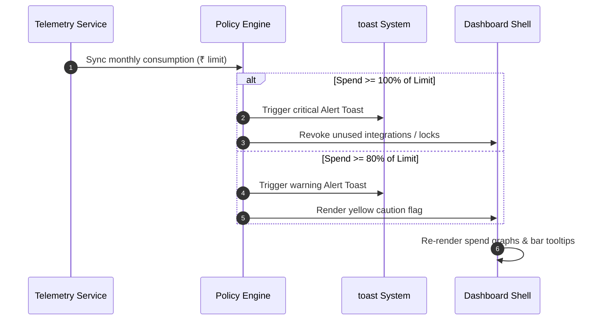

# 💎 Vantage AI — Enterprise AI Spend Control & Governance

Vantage AI is a premium, real-time cost observability, telemetry, and budget guardrail dashboard designed for high-growth tech teams to monitor, govern, and optimize organization-wide AI API usage.

Built as an ultra-high performance dark-mode Single-Page Application (SPA) backed by Firebase Authentication and custom WebGL background telemetry layers, Vantage AI enables deep visibility into token-level costs, active seats, and credit caps.

---

## 🚀 Key Features

* **3D Spline Interactive Telemetry**: Embedded background canvas loading interactive WebGL concept graphics with zero input lag.
* **Per-Second Token Stream Analysis**: Tracks prompt, completion, and total tokens across text, image, and voice models.
* **Granular Budget Guardrails**: Automated soft and hard thresholds per department (Engineering, Data, Video, Operations) with instant warning prompts.
* **Supported AI APIs Integration**: Tracks API keys across OpenAI, Google Gemini, Anthropic Claude, ElevenLabs, Meta Llama, and Cohere.
* **Tacit Toast Notification System**: Rich alerts, warning state transitions, and real-time system alerts.
* **Real CSV Export**: Generates and compiles audit reports directly within the client browser.
* **Dynamic Collapsible Navigation Rail**: Toggles seamlessly to preserve workspace layout.
* **Google Auth (Firebase)**: Strict verification layers showing landing page specs until validated.

---

## 📊 System Architecture & Telemetry Flow

The following charts outline the ingestion of token events, translation to rupee credit costs, and department limit checks.

### 1. Token Telemetry Ingestion Flow
This flowchart shows how raw user prompt tokens are captured by the SDK, costed in INR, and stored:



### 2. Budget Alert & Threat Threshold Sequence
This sequence shows the path of a telemetry sync event triggering warning banners and hard locks:



---

## 🛠️ Codebase Structure

```
├── index.html         # Main Monolithic SPA Shell (Tailwind, Firebase, View sections)
├── app.js             # Client dashboard logic, charts rendering, events handlers
├── styles.css         # Custom animations, marquee scroller, Spline positioning
├── data/
│   └── mockData.js    # Mock data definitions (connected providers, team members)
├── firebase.json      # Routing configuration, SPA rewrites, and Cache-Control headers
└── .firebaserc        # Firebase targets config (project ID: vantage-ai-eda2c)
```

---

## 💻 Local Setup & Development

To run the Vantage AI dashboard locally:

1. **Clone the repository**:
   ```bash
   git clone https://github.com/hydra-eng/vantage-ai.git
   cd vantage-ai
   ```

2. **Serve the project**:
   Use a local HTTP server to run the project. For example, using Python's built-in module:
   ```bash
   python -m http.server 8000
   ```
   Or using node's `live-server` or `serve`:
   ```bash
   npx serve .
   ```

3. **Open the browser**:
   Navigate to `http://localhost:8000` to interact with the full dashboard.

---

## ☁️ Production Deployment

Vantage AI is integrated with **Firebase Hosting** for optimized SPA delivery and CDN cache control.

### Deploying Updates:
1. Log in to Firebase CLI:
   ```bash
   npx firebase-tools login
   ```
2. Build and deploy to production:
   ```bash
   npx firebase-tools deploy --only hosting --project vantage-ai-eda2c
   ```
3. Live production access is served via:
   **[https://vantage-ai-eda2c.web.app](https://vantage-ai-eda2c.web.app)**

---

## ⚖️ License
Distributed under the MIT License. See `LICENSE` for more information.
