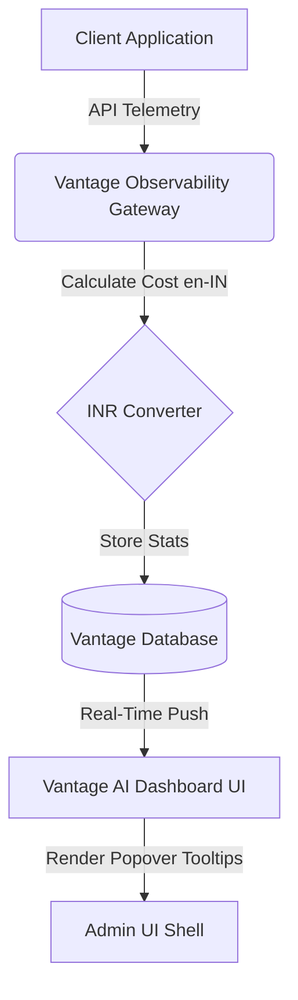
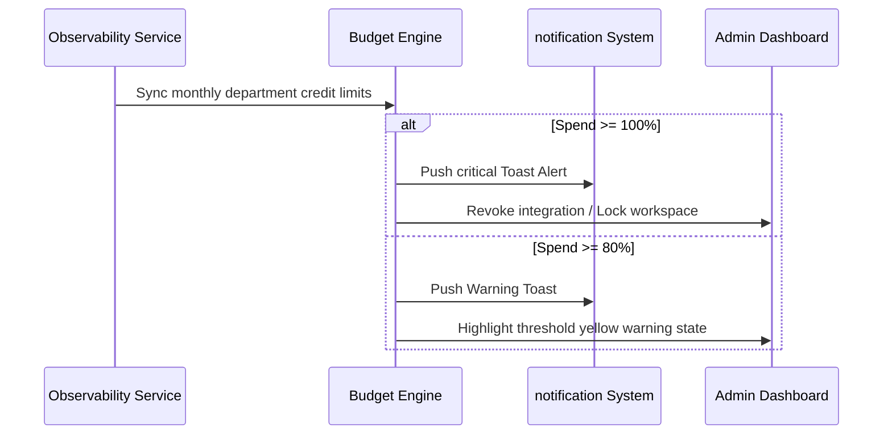

<div align="center">

# 💎 Vantage AI
### Enterprise AI Cost Observability & Governance Platform

[](#)
[](https://vantage-ai-eda2c.web.app)
[](#)

---

**Vantage AI** is a premium, high-fidelity spend governance portal designed for engineering, marketing, and data teams. Track model tokens, configure strict budget warning/hard limits, and analyze real-time usage metrics in one interactive dashboard.

[**Explore Live Application ➔**](https://vantage-ai-eda2c.web.app)

</div>

---

## ⚡ Core Capabilities

- 🤖 **Interactive WebGL Background** — Immersive 3D Spline Nexbot Robot rendering with optimized touch and scroll physics.
- ⏱️ **Real-Time Telemetry Stream** — Immediate per-second tracking of prompt/completion tokens.
- 🛡️ **Budget Guardrails** — Automated soft (80%) and hard (100%) limits per department.
- 📡 **Multi-Provider Support** — Consolidated observability for OpenAI, Gemini, Anthropic Claude, ElevenLabs, Meta Llama, and Cohere.
- 📋 **On-the-fly CSV Export** — Client-side compilation and download of employee/provider auditing logs.
- 🔒 **Firebase Authentication** — Strict Google Sign-in flow verification locking the app state until authenticated.

---

## 📊 System Topology & Telemetry Flow





---

## 📂 Repository Structure

```
├── index.html         # Main Web Application Shell (All UI, state & script telemetry)
├── firebase.json      # Routing configuration, SPA rewrites, and Cache-Control headers
└── .firebaserc        # Firebase project targets mapping configuration
```

---

## 🚀 Quick Start

### 1. Run Locally
Serve the directory using any static HTTP server. For example:
```bash
npx serve .
```
Or with Python:
```bash
python3 -m http.server 8080
```
Open **`http://localhost:8080`** in your browser.

### 2. Deploy to Production
Make sure you have `firebase-tools` installed:
```bash
npm install -g firebase-tools
firebase deploy --only hosting --project vantage-ai-eda2c
```
Live production instances are hosted at **`https://vantage-ai-eda2c.web.app`**.
