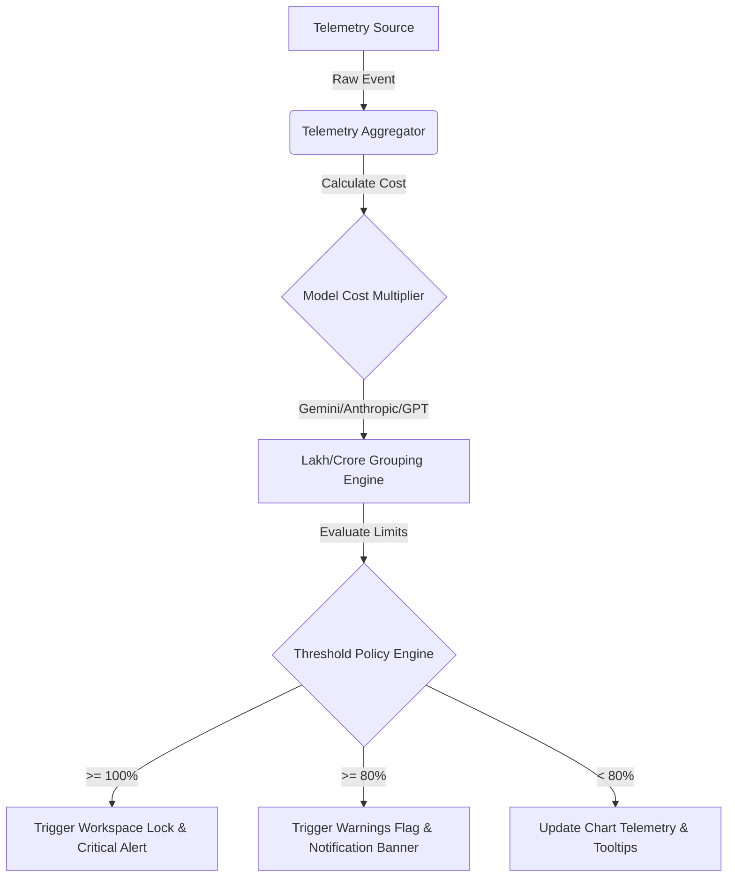
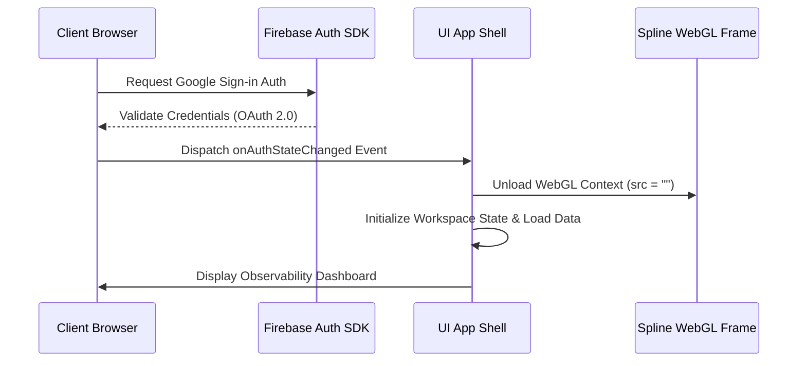

# Vantage AI

### Enterprise-Grade Observability, Telemetry, and Spend Governance for AI APIs

Vantage AI provides centralized visibility and governance for team-wide artificial intelligence API consumption. Built as a self-contained Single-Page Application (SPA) with Firebase Integration and WebGL-accelerated 3D background telemetry, Vantage AI translates raw token metrics into real-time spend analytics, budget alerts, and active seat monitoring.

[**Explore Live Application**](https://vantage-ai-eda2c.web.app) | [**View Documentation**](#system-architecture)

---

## Technical Overview

Modern development teams experience rapid cost inflation due to unmonitored LLM token utilization, redundant API keys, and unmanaged agent feedback loops. Vantage AI solves this by introducing a client-side governance dashboard that consumes, formats, and displays telemetry logs from major providers.

### Core Capabilities

- **Zero-Lag WebGL Background** - Optimized 3D Spline character concept running within an isolated background container using pointer-event bypasses to prevent scrolling stutters.
- **Per-Second Telemetry Ingestion** - Live token tracking (Prompt and Completion breakdown) translated into local currency groupings (INR Lakh/Crore formatting).
- **Dual-Threshold Budget Guardrails** - Automatic triggers at 80% (warning state) and 100% (hard cap block) of monthly allocations, managed via client-side notification triggers.
- **Unified Key Access** - Consolidated management for OpenAI, Google Gemini, Anthropic Claude, ElevenLabs, Meta Llama, and Cohere.
- **Dynamic Workspaces** - Collapsible navigation layout, responsive detail drawers for individual employee audit logs, and on-the-fly CSV generation.

---

## System Architecture

The client application aggregates metrics and compares consumption records against department policy constraints. 

```
                                +---------------------------+
                                |     Client App (SDK)      |
                                +-------------+-------------+
                                              |
                                              v (API Telemetry)
                                +-------------+-------------+
                                |  Vantage Telemetry Service |
                                +-------------+-------------+
                                              |
                                              v (Cost Translation Engine)
+-----------------------+       +-------------+-------------+
| Gemini/GPT Cost Map   | ----> |  en-IN Currency Formatter  |
+-----------------------+       +-------------+-------------+
                                              |
                                              v (State Persistence)
                                +-------------+-------------+
                                |  Firebase Auth System     |
                                +-------------+-------------+
                                              |
                                              v (Real-time View State)
                                +-------------+-------------+
                                |  Administration Dashboard |
                                +---------------------------+
```

### Telemetry Processing & Data Ingestion Flow

1. **Ingestion Loop**: Direct token telemetry metrics are captured from model providers, splitting costs into prompt processing, completion generation, and model-specific multiplier parameters.
2. **Cost Formatting (en-IN Locale)**: Rupee calculation is localized using the lakh/crore naming convention with exact rounding parameters.
3. **Budget Verification**: Active limits are verified per transaction. If a limit is breached, the UI triggers warning flags or stops incoming telemetry streams.



### Authentication & Telemetry Lifecycle

Vantage AI enforces strict authorization boundaries using Firebase Authentication. If a user is unauthenticated, the application displays a full-screen landing portal loading the WebGL viewport assets. Upon successful Google OAuth validation, the system:
1. Destroys the WebGL iframe context (setting the `src` to `""`) to prevent background memory leaks and release GPU cycles.
2. Animates the dashboard transition.
3. Restores layout states based on cached client workspace preferences.



---

## Repository and Codebase Layout

To maintain a clean and lightweight deployment context, boilerplate, unused, and helper files are ignored by default. The tracking structure is defined as follows:

```
├── index.html         # Monolithic SPA (Views, UI layout, script logic, and stylesheets)
├── firebase.json      # Production Hosting config, SPA rewrites, Cache-Control headers
├── .firebaserc        # Target mapping configuration (vantage-ai-eda2c)
└── .gitignore         # Local asset exclusion policies
```

---

## Deployment & Production Configuration

The application is deployed to Firebase Hosting. The routing and caching headers are explicitly managed to prevent stale CDN states.

### Firebase Configuration (`firebase.json`)

To prevent browsers from caching the single-page application script state on code revisions, custom headers are applied to bust the CDN and local browser storage layers:

```json
{
  "hosting": {
    "public": ".",
    "ignore": [
      "firebase.json",
      "**/.*",
      "**/node_modules/**"
    ],
    "headers": [
      {
        "source": "**/*.@(html|js|css)",
        "headers": [
          {
            "key": "Cache-Control",
            "value": "max-age=0, no-cache, no-store, must-revalidate"
          }
        ]
      }
    ],
    "rewrites": [
      {
        "source": "**",
        "destination": "/index.html"
      }
    ]
  }
}
```

### Deploy Commands

To release updates to the live hosting targets:

1. Install Firebase CLI locally:
   ```bash
   npm install -g firebase-tools
   ```
2. Verify hosting endpoints and push code:
   ```bash
   firebase deploy --only hosting --project vantage-ai-eda2c
   ```

Live Endpoint: **`https://vantage-ai-eda2c.web.app`**
